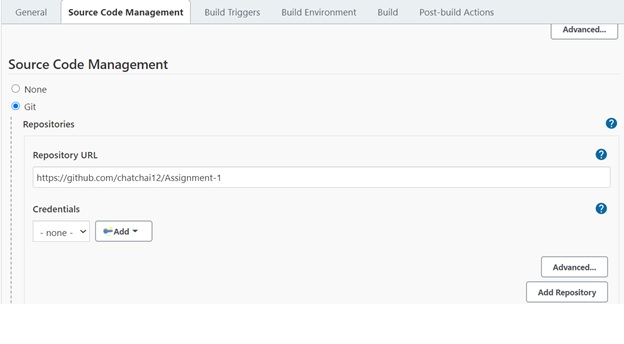
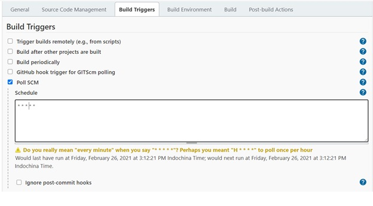
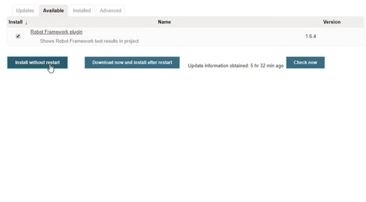
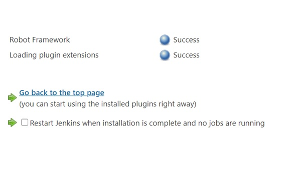

## ขั้นตอนการติดตั้ง **Jenkins**

### ขั้นตอนที่ 1 
ทำการดาวน์โหลด **Jenkins** จาก https://www.jenkins.io/download/
โดยเลือก **Download Jenkins version for : Windows** (ในกรณีที่ใช้ระบบปฏิบัติการ Windows)
	

	
(ในที่นี้ใช้ version 2.281)

	> หากในเครื่องไม่มี JRE ต้องทำการติดตั้ง JRE ก่อน โดยสามารถดูได้จาก cmd และพิมพ์ java
	> โดยสามารถดาวน์โหลดได้จาก https://www.oracle.com/java/technologies/javase-jre8-downloads.html
	> เมื่อติดตั้งเสร็จแล้วให้ทำการ **PATH** ที่อยู่ของ Java แล้วรีสตาร์ทเครื่อง
	

	
### ขั้นตอนที่ 2
เมื่อทำการดาวน์โหลดเสร็จแล้วให้ทำการติดตั้ง 

	>การ pull git

	>ตั้งค่าเวลาการ ดึง

	>ติดตั้ง Robot framework plugin

	>หากสำเร็จจะขึ้น succeed